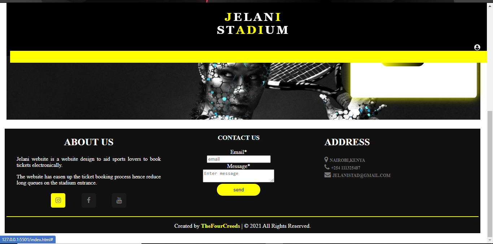

# JELANI STADIUM TICKET MANAGEMENT SYSTEM

This is a website designed to automate the process of ticket booking to eradicate the manual way of booking tickets.

## Introduction

Ideally sports lovers should easily be able to access their favorite sports games at any time. However, in reality stadiums have used the manual way of booking tickets, that is along the stadium entrance. This leads to wastage of time and long queues during ticket booking process. Jelani is a stadium web application that will be designed to help users book tickets online and at their own free will. Users will also be able to book reservations for concerts and events. The app will be optimized for viewing on different screen sizes to enhance user experience. Users sign up details will be kept securely to avoid breach of personal data.

## Table of contents

- [JELANI STADIUM TICKET MANAGEMENT SYSTEM](#jelani-stadium-ticket-management-system)
  - [Introduction](#introduction)
  - [Table of contents](#table-of-contents)
    - [Objective](#objective)
    - [Special Objectives](#special-objectives)
      - [The users of the system](#the-users-of-the-system)
        - [Functional Requirements](#functional-requirements)
        - [1. Sports Module](#1-sports-module)
      - [2. Authentication module](#2-authentication-module)
  - [SOFTAWARE DESIGN DESCRIPTION](#softaware-design-description)
    - [SDD Introduction](#sdd-introduction)
      - [User interface design](#user-interface-design)
    - [Database Design](#database-design)
      - [users table](#users-table)
      - [Ticket table](#ticket-table)
      - [Event table](#event-table)

### Objective

The general objective of this website, was to build a website that would automate the ticket and event booking website electronically so as to avoid long queues at the stadium entrance, save time and enhance good customer relation and services.

### Special Objectives

1. To design a system that will enable user to access information about all the matches/events that will be held in the stadium, the exact date and time they will start and end.

1. Design a system that will give clear data or records to the management on how transactions are conducted.

1. Design a system that will provide data security, that is keep clients and management information from being accessed by an authorized person.

1. To develop an authentication module where a new user can sign up and create an account and book a ticket at the comfort of his /her home.

1. To develop an admin module for key Ticket management operations, e.g., Keep track of tickets, sending texts to clients to confirm ticket booking, giving out unique ticket numbers to avoid ticket repetition.

1. To develop a database for storing and managing Ticket booking records.

1. To synchronize the modules with the database.

1. To develop a better and easy user interface for both the management, staff, and new user to use during ticket booking process for better user experience.

#### The users of the system

The users of the system will include:

1. **Staff** - will be able to monitor User’s tickets reports to avoid fraud.

1. **Event holder** - will be able to converse to manager and plan on the event.

1. **Client** - will be able to see the landing page and even sign up and sign in to the system and book tickets.

1. **Authenticator User** - will be able to confirm user’s details during sign up and sign process.

1. **Sports officials** - will be able to sign up and converse directly with the stadium manager on the sports details.

1. **Stadium manager** - will be in charge of the daily stadium tasks.

1. **Developer Projects Manager** - will be in charge of the website, i.e. keep the stadium website UpToDate.

**Technical Requirements**
This application will be build on the following technologies:

- HTML,CSS,JavaScript

- Bootstrap

- PHP

- MySQL

Apache Web Server

##### Functional Requirements

##### 1. Sports Module

- **Ticket booking** - Contains a button where user is able to book ticket to an event or sports.

- **Ticket cancellation** - contains a cancellation button incase user decides to cancel the ticket.

- **Ticket update** - Contains an update where user is able to update his/her details on the ticket.

#### 2. Authentication module

- login page
  Provides user with text fields where they can enter the username and passwords.

- Provides a button where user can login to the system.

- Has a registration button that enables a new user to regester and be part of the system.

- This page also enables user after login to be able to edit their profiles.

- It also enables user to change their password and username after login.

## SOFTAWARE DESIGN DESCRIPTION

This Contains the design to our system.

### SDD Introduction

It contains a summaried design of jelani system.

#### User interface design

- Sign up and Sign in page

- **sign up**

- **sign in**

- **Home page**

- **Footer**

### Database Design

contains tables of the system database.

#### users table

| column   | Type     |
| -------- | -------- |
| id       | int(pk)  |
| email    | tinytext |
| username | tinytext |
| password | text     |

#### Ticket table

| column        | Type     |
| ------------- | -------- |
| id            | int(pk)  |
| Ticket number | VARCHAR  |
| Class         | tinytext |
| Time          | date     |
| time_booked   | int      |

#### Event table

| column       | Type     |
| ------------ | -------- |
| id           | int(pk)  |
| Name         | tinytext |
| Addres       | VARCHAR  |
| Email        | tinytext |
| Date_booked  | DATE     |
| No of people | int      |
